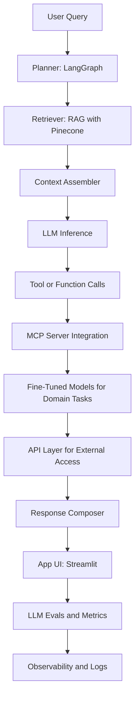

<h1 align="center">Hi, I'm Rajarshi Nandi 👋</h1>

  <b>AI Engineer</b> • Rapid Prototyping • RAG • Tool Calling • MCP Servers • LLM Evals • Fine-Tuning • APIs • Streamlit • GCP  
   
  Turning ideas into shipped AI apps with measurable ROI.

  <a href="https://www.linkedin.com/in/rajarshi-nandi/">LinkedIn</a> •
  <a href="https://github.com/rajo69">GitHub</a> •
  <a href="mailto:rajarshin264@gmail.com">Email</a>

---

### 🚀 What I Do
- **Prototype & iterate AI apps fast** with LangChain/LangGraph, HuggingFace, RAG + vector DBs (Pinecone), and Streamlit.  
- **Ship to production** on **GCP**, with clean and reproducible repos.  
- **Engineer advanced LLM systems**:  
  - 🔧 Function & tool calling workflows  
  - 🌐 MCP (Model Context Protocol) server integrations  
  - 🎯 Fine-tuning (SFT) for domain-specific tasks  
  - 🔌 API development for scalable AI service integration  
  - ✅ LLM evaluation frameworks for benchmarking & QA  
- **Collaborate across teams** (data engineers, scientists, stakeholders) to deliver tangible ROI.  

**Selected outcomes:**  
- 📈 Improved marketing ROI by **14%** and revenue by **6%**.  
- 💰 Helped secure **$45K** in investments with data-driven strategies.  
- ⚙️ Reduced churn by **9%** with predictive modeling.  
- 📊 Cut processing time by **23%** with hardened ETL pipelines.  

---

### 🧰 Tech I Work With

  
  
  
  
  
  
  
  
  
  
  
  
  
  
  
  
  
  
  

---

### 🌟 Featured Projects
**1) Job Lens AI — Resume↔JD Fit + Interview Prep**  
Semantic matching + skill gap analysis using **Groq LLM API (Llama 3.1 8B)**, **LangChain**, and **Streamlit** on **GCP**.  
🔗 [GitHub Repo](https://github.com/rajo69/job_lens_ai)

**2) Robust CNN — Hybrid Adversarial Training (CIFAR-10)**  
Boosted robustness by **6100%** while keeping **88%** accuracy; MATLAB on HPC.  
🔗 [GitHub Repo](https://github.com/rajo69/Enhancing-Neural-Network-Robustness-using-Hybrid-Adversarial-Training)

**3) Time-Series + Text Analytics**  
Forecasted consumer spending & analyzed hotel reviews with R (time-series + NLP).  
🔗 [GitHub Repo](https://github.com/rajo69/Time-Series-Forecasting-Text-Analytics)  
🔗 [Shiny App Demo](https://rgox6k-rajarshi-nandi.shinyapps.io/Shiny_Mushroom_App/)

---

### 🧩 AI Engineering Workflow (RAG + Tool Calls + MCP + Fine-Tuning + APIs + Evals)

---

### 🎯 Now
- Prototyping **RAG apps** with LangChain/LangGraph + Pinecone.  
- Exploring **tool/function calling pipelines** and **MCP servers**.  
- Implementing **fine-tuned LLMs** for domain-specific accuracy.  
- Building **API endpoints** to expose AI models as services.  
- Designing **LLM eval workflows** to measure faithfulness, latency, and ROI.  
- Deploying **Streamlit apps** on **GCP** with lightweight CI/CD.  
- Open to **AI Engineer roles** (UK/EU).  

---

### 🎓 About Me
- MSc **Data Science & Analytics**, University of Leeds (First-class).  
- Ex-IBM **Application Developer**: ML, ETL, dashboards, stakeholder engagement.  

---

### 🤝 Let’s Connect
If you’re exploring **AI apps that deliver ROI**, let’s chat!  
📫 rajarshin264@gmail.com | 🔗 [LinkedIn](https://www.linkedin.com/in/rajarshi-nandi/)

---

  

